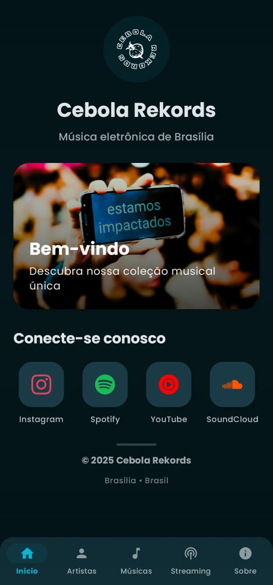
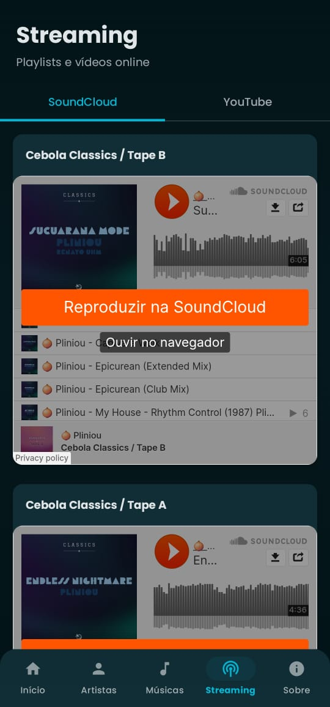
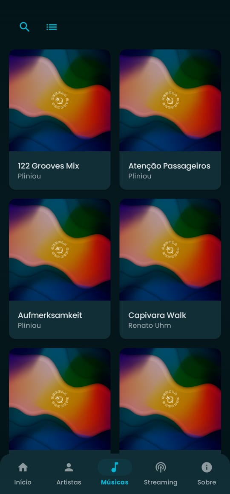
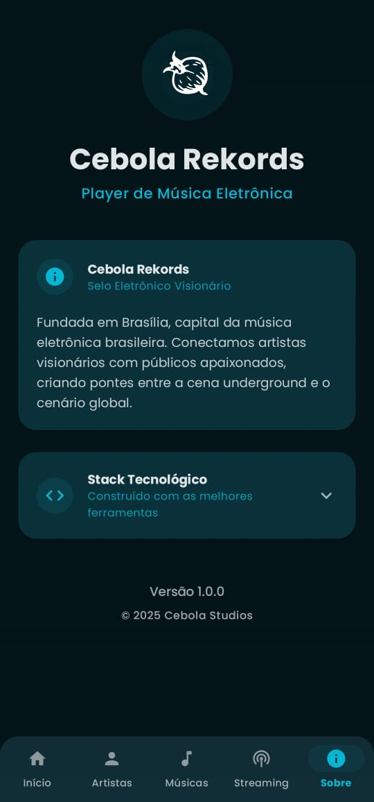

# 🎵 Cebola Rekords Music Player
Uma solução da Cebola Studios para reproduzir músicas fictícias – com um catálogo tão bom que você vai lamentar não ser real.

 ## ✨ Funcionalidades Principais
- 🎶 Player com reprodução em segundo plano e controles avançados.
- 🎨 Interface com tema escuro e animações fluidas.
- 🎵 Biblioteca organizada por artistas, álbuns e playlists.
- 🔍 Busca avançada e filtros inteligentes.
- 🔧 Otimizações para cache e performance offline.

## 🛠️ Stack Tecnológica
- **Media**: Media3 (ExoPlayer) `1.3.1`
- **UI**: Jetpack Compose `1.6.7`
- **Splash Screen**: Core Splashscreen `1.0.1` - **Banco de Dados**: Room `2.6.1`
- **Injeção de Dependências**: Hilt `2.48`
- **Arquitetura**: Clean Architecture com MVVM

## 📸 Screenshots

| Tela Inicial | Artistas | Biblioteca | Player |
|-------------|----------|------------|--------|
|  |  |  |  |

## 🚀 Instalação
1. Clone o repositório: `git clone https://github.com/pliniou/cebola-rekords.git`
2. Abra no Android Studio e sincronize o Gradle.
3. Construa o projeto: `./gradlew clean build` ## 🏗️ Estrutura do Projeto
- `app/src/main/`: Código principal (data, domain, presentation).
- `app/src/test/`: Testes unitários.
- `app/src/androidTest/`: Testes instrumentados.
- `screenshots/`: Imagens da documentação.

## 🧪 Testes
Para executar todos os testes unitários, use: `./gradlew test`

## 📄 Licença
Este projeto está licenciado sob a Licença MIT. Veja o arquivo `LICENSE` para mais detalhes. Desenvolvido pela Cebola Studios.