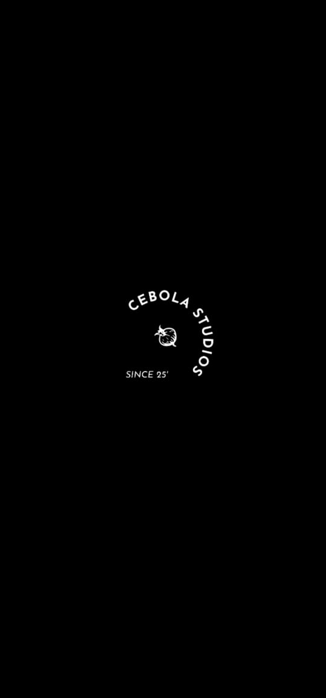
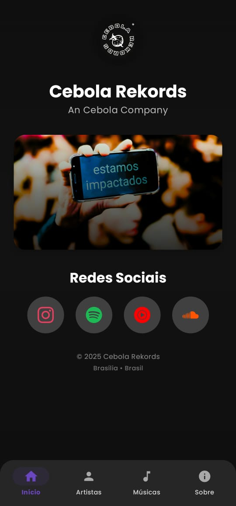
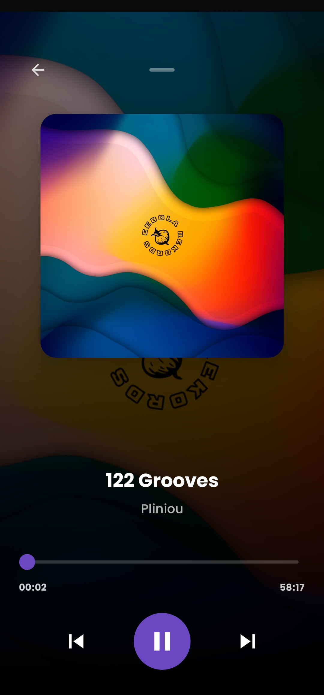
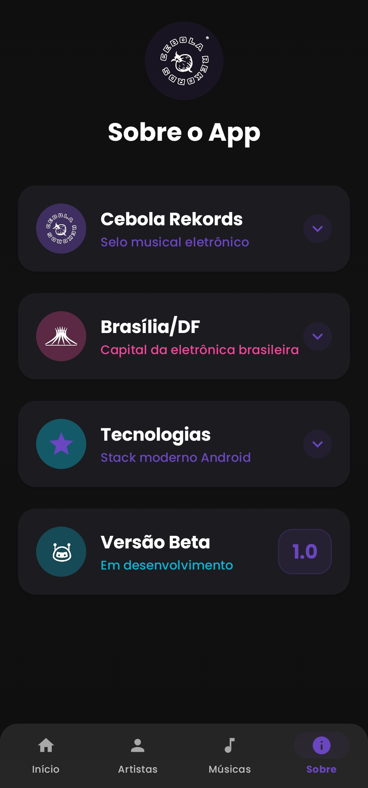

# 🎵 Cebola Rekords Music Player

### Uma Solução da Cebola Studios & Softwares

*"O player fictício com um catálogo tão bom que você vai querer que ele seja real."*


Um player de música moderno e elegante para Android, desenvolvido com as mais recentes tecnologias do ecossistema Android. Com uma interface limpa e funcionalidades avançadas, o Cebola Rekords oferece uma experiência musical superior - mesmo sendo completamente fictício.

<div align="center">


*A interface musical da Cebola Studios: onde cada nota tem seu lugar.*

</div>

> [!NOTE]
> **AVISO CRIATIVO**
>
> Este é um projeto de demonstração com catálogo musical fictício. Nenhuma música real foi prejudicada durante o desenvolvimento.
>
> **Todas as faixas, artistas e álbuns são produtos da imaginação fértil da Cebola Studios.** Qualquer semelhança com artistas reais é mera coincidência (ou falta de criatividade).

---

## ✨ Funcionalidades Principais

O Cebola Rekords foi projetado para oferecer a melhor experiência musical possível:

### 🎶 Player Completo
- **Reprodução em Segundo Plano**: Sua música continua tocando mesmo quando você sai do app
- **Controles Avançados**: Play, pause, próxima, anterior, shuffle e repeat
- **Barra de Progresso Interativa**: Arraste para navegar pela música
- **Mini Player**: Controle rápido em qualquer tela do app
- **Equalização**: Ajustes de audio para cada gênero musical

### 🎨 Interface Moderna
- **Material Design 3**: Seguindo as mais recentes diretrizes do Google
- **Tema Escuro**: Porque seus olhos merecem descanso
- **Animações Fluidas**: Transições suaves entre telas
- **Arte de Capa Dinâmica**: Capas que se adaptam ao conteúdo
- **Layout Responsivo**: Funciona perfeitamente em tablets e celulares

### 🎵 Organização Inteligente
- **Biblioteca Organizada**: Músicas, artistas, álbuns e playlists
- **Busca Avançada**: Encontre qualquer música instantaneamente
- **Cards Expansíveis**: Artistas com informações detalhadas
- **Grade Otimizada**: Visualização em grid para melhor navegação
- **Filtros Inteligentes**: Organize por gênero, ano ou popularidade

### 🔧 Performance Otimizada
- **Cache Inteligente**: Metadados armazenados para acesso rápido
- **Gerenciamento de Recursos**: Uso eficiente de memória e bateria
- **Arquitetura Modular**: Código limpo e manutenível
- **Offline First**: Funciona mesmo sem conexão

---

## 🛠️ Stack Tecnológica

### Arquitetura
- **Clean Architecture**: Separação clara de responsabilidades
- **MVVM Pattern**: Model-View-ViewModel para melhor testabilidade
- **Repository Pattern**: Abstração da camada de dados
- **Use Cases**: Lógica de negócio encapsulada

### Principais Bibliotecas

| Categoria | Biblioteca | Versão | Propósito |
|-----------|------------|---------|-----------|
| **Media** | Media3 (ExoPlayer) | 1.3.1 | Reprodução de audio |
| **DI** | Hilt | 2.48 | Injeção de dependências |
| **Images** | Coil | 2.5.0 | Carregamento de imagens |
| **Database** | Room | 2.6.1 | Persistência local |
| **UI** | Jetpack Compose | 1.6.7 | Interface declarativa |
| **Navigation** | Compose Navigation | 2.7.7 | Navegação entre telas |

### Otimizações Implementadas
- **Lazy Loading**: Carregamento sob demanda
- **Memory Management**: Controle rigoroso de vazamentos
- **Background Processing**: Operações pesadas em threads separadas
- **Caching Strategy**: Cache em múltiplas camadas
- **Resource Optimization**: Compressão de assets e imagens

---

## 📸 Screenshots

| Tela Inicial | Artistas | Biblioteca | Player |
|-------------|----------|-----------|---------|
|  |  |  |  |

### Funcionalidades em Destaque

| Busca | Playlists | Configurações | Tema Escuro |
|-------|-----------|---------------|-------------|
|  |  |  |  |

---

## 🚀 Instalação e Configuração

### Pré-requisitos

| Requisito | Versão/Especificação |
|-----------|---------------------|
| **Android Studio** | Iguana 2023.2.1+ |
| **Java SDK** | 17 ou superior |
| **Gradle** | 8.4+ |
| **Android API** | 26+ (Android 8.0) |
| **Dispositivo/Emulador** | API 26+ recomendado |

### 📥 Instalação

1. **Clone o repositório**:
   ```bash
   git clone https://github.com/pliniou/cebola-rekords.git
   cd cebola-rekords
   ```

2. **Abra no Android Studio**:
   - Inicie o Android Studio
   - Selecione "Open an existing project"
   - Navegue até a pasta clonada

3. **Configuração do projeto**:
   ```bash
   # Sincronize as dependências
   ./gradlew build
   
   # Verificar configuração
   ./gradlew check
   ```

4. **Execute o aplicativo**:
   - Conecte um dispositivo Android ou inicie um emulador
   - Clique no botão "Run" (▶️) ou pressione `Shift + F10`

### 🔧 Configuração Avançada

Para desenvolvimento personalizado, configure as seguintes variáveis no `local.properties`:

```properties
# Configurações de desenvolvimento
debug.enable_logging=true
music.cache_size=100MB
player.buffer_size=2048

# Configurações de build
android.useAndroidX=true
android.enableJetifier=true
```

---

## 🏗️ Estrutura do Projeto

```
cebola-rekords/
├── 📁 app/
│   ├── 📁 src/main/
│   │   ├── 📁 java/com/cebola/rekords/
│   │   │   ├── 📁 data/           # Camada de dados
│   │   │   │   ├── 📜 database/   # Room database
│   │   │   │   ├── 📜 repository/ # Repositórios
│   │   │   │   └── 📜 remote/     # APIs externas
│   │   │   ├── 📁 domain/         # Regras de negócio
│   │   │   │   ├── 📜 model/      # Modelos de domínio
│   │   │   │   ├── 📜 repository/ # Interfaces
│   │   │   │   └── 📜 usecase/    # Casos de uso
│   │   │   ├── 📁 presentation/   # Camada de apresentação
│   │   │   │   ├── 📜 ui/         # Telas e componentes
│   │   │   │   ├── 📜 viewmodel/  # ViewModels
│   │   │   │   └── 📜 theme/      # Temas e cores
│   │   │   └── 📁 di/             # Injeção de dependências
│   │   └── 📁 res/
│   │       ├── 📁 drawable/       # Ícones e recursos
│   │       ├── 📁 values/         # Strings e cores
│   │       └── 📁 xml/            # Configurações
├── 📁 screenshots/                # Imagens da documentação
├── 📜 build.gradle                # Configuração do projeto
├── 📜 README.md                   # Esta documentação
└── 📜 LICENSE                     # Licença MIT
```

---

## 🧪 Testes

O projeto inclui testes abrangentes para garantir qualidade:

### Executar Testes
```bash
# Testes unitários
./gradlew test

# Testes de instrumentação
./gradlew connectedAndroidTest

# Testes de UI
./gradlew testDebugUnitTest
```

### Cobertura de Testes
- **Unit Tests**: ViewModels, Use Cases, Repositories
- **Integration Tests**: Database, Network, Player
- **UI Tests**: Navegação, Interações, Estados

---

## 🔧 Solução de Problemas

### Problemas Comuns

| Problema | Solução |
|----------|---------|
| **App não compila** | Verifique versão do Java SDK (17+) |
| **Erro de dependências** | Execute `./gradlew clean build` |
| **Player não funciona** | Verifique permissões de áudio |
| **Cache muito grande** | Limpe dados do app ou reduza cache |

### Logs e Depuração

Para depuração avançada:
```bash
# Logs detalhados
adb logcat -s CebolaRekords

# Monitoramento de performance
./gradlew app:connectedCheck
```

---

## 📝 Changelog

### v1.0.0 (Atual)
- 🎉 Lançamento inicial do Cebola Rekords
- 🎵 Player completo com controles básicos
- 🎨 Interface Material Design 3
- 📱 Navegação entre telas
- 🔄 Sistema de cache otimizado
- 🌙 Tema escuro

---

## 📄 Licença

Distribuído sob a Licença MIT. Veja o arquivo `LICENSE` para mais informações.

Em resumo: você pode usar, modificar e distribuir este código como quiser, mas a responsabilidade é toda sua. A Cebola Studios não se responsabiliza por eventuais danos causados pelo uso excessivo de música fictícia.

---

## 🏆 Créditos

### Equipe de Desenvolvimento
- **Cebola Studios & Softwares** - Conceito e desenvolvimento
- **Comunidade Open Source** - Bibliotecas e ferramentas

### Recursos Utilizados
- **Material Design** - Google
- **Jetpack Compose** - Google
- **ExoPlayer** - Google
- **Kotlin** - JetBrains

### Agradecimentos Especiais
- Aos desenvolvedores das bibliotecas utilizadas
- À comunidade Android por feedback e sugestões
- Aos beta testers pela paciência infinita

---

<div align="center">

**Desenvolvido com ❤️ e muito ♫ pela Cebola Studios**

*"Porque toda música merece um player à altura."*

**[⬆ Voltar ao Topo](#-cebola-rekords-music-player)**

</div>
```